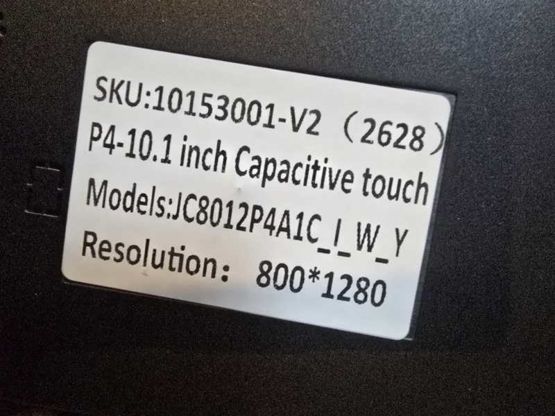

<!-- SPDX-License-Identifier: LicenseRef-FNCL-1.1 | Copyright (c) 2026 Cpt_Kirk -->


# BETTA HA Panel — Guiton 10 (10.1") · JC8012P4A1C-I-W-Y (V2)

> **EN** — Runtime-configurable diagnostic wall panel for **Home Assistant + Glances**, running on the **Guition JC8012P4A1C-I-W-Y (V2)** 10.1-inch ESP32-P4 touch display. Build your dashboard directly on the device — no YAML edits, no firmware rebuilds. This is the `panel10jc` variant of **BETTA HA Panel** by **Cpt_Kirk (cptkirki)**.
>
> **PL** — Konfigurowalny w locie panel diagnostyczny dla **Home Assistant + Glances**, działający na 10,1-calowym wyświetlaczu dotykowym **Guition JC8012P4A1C-I-W-Y (V2)** (ESP32-P4). Pulpit budujesz bezpośrednio na urządzeniu — bez edycji YAML i bez ponownej kompilacji. To wariant `panel10jc` projektu **BETTA HA Panel** autorstwa **Cpt_Kirk (cptkirki)**.

**GitHub „About" (opis repozytorium):** `ESP32-P4 · 10.1" · Home Assistant + Glances diagnostic wall panel with on-device web editor, graphical screensaver, energy dashboard and server/network monitoring. Wariant Guition JC8012P4A1C-I-W-Y (panel10jc).`

---

## 📸 Screenshots / Zrzuty ekranu

### Web editor — BETTA Editor (`http://<panel-ip>/`)
| Layout / Układ | Quick Setup / Szybka konfiguracja |
|----------------|-----------------------------------|
|  |  |

### Settings / Ustawienia (WWW)
| Screen / Ekran (screensaver) | System |
|------------------------------|--------|
|  |  |

| Wi-Fi |
|-------|
|  |

### Widget configuration / Konfiguracja widżetów (WWW)
| Machine / CPU tile (font sizes, LAN/WAN, power) | Network tile (LAN/WAN, TCP/UDP, devices) | Temperature tile (graphic ring) |
|-------------------------------------------------|------------------------------------------|---------------------------------|
|  |  |  |

### On-device dashboard / Pulpit na panelu
| Live dashboard / Pulpit na żywo | Top bar | Navigation | Tile area |
|---------------------------------|---------|------------|------------|
|  |  |  |  |

### Photos of the working panel / Zdjęcia działającego panelu
| Main menu / Menu główne | Screensaver / Wygaszacz |
|-------------------------|-------------------------|
|  |  |

### Hardware revision / Rewizja sprzętowa — V2

**EN** — This panel and its firmware target the **V2** revision of the
JC8012P4A1C-I-W-Y board. **PL** — Ten panel i jego firmware dotyczą rewizji **V2**
płytki JC8012P4A1C-I-W-Y.

| SKU label / Etykieta SKU |
|--------------------------|
|  |

**SKU:** `10153001-V2 (2628)` · P4 · 10.1" capacitive touch · Models: JC8012P4A1C_I_W_Y · Resolution: 800×1280

---

## ✨ Features / Funkcje

**EN**
- **Live Home Assistant link** — WebSocket connection with REST fallback (forecasts, long-poll states).
- **On-device editor** — BETTA Editor in the browser at `http://<panel-ip>`; multi-page layouts, drag-and-drop, room-grouped entity picker. No rebuild needed.
- **Widget library** — sensor, temperature (text + graphic ring), weather (current + up to 5-day forecast), binary sensor, presence, light, switch, button, slider, cover, fan, heating, lock, number, select, media player, todo, Roborock, graph, monitor, entity list, gauge/bars, energy dashboard; Quick Setup presets: machine/CPU, servers, network (LAN/WAN/TCP/UDP), Glances.
- **Built-in camera** — OV02C10 MIPI-CSI: JPEG snapshot, MJPEG stream for HA, motion detection (sensitivity, zones, min area/duration, cooldown, ignore lighting) with motion-based screen wake, H/V flip, JPEG quality.
- **IP cameras** — up to 4 Home Assistant `camera.*` entities or HTTP snapshot URLs.
- **Xiaozhi AI** — built-in voice assistant (off by default; enable in Settings → Xiaozhi AI + cloud pairing).
- **Tile styling** — per-tile font size and scale, tile display styles (gauge/bars/arc, graphic ring), theme colours, UI scale and font settings.
- **Energy dashboard** — automatic grid / solar / battery / gas / water flow from the Home Assistant energy model.
- **Graphs** — line, smoothed line, bar charts; event-rate sampling up to 4096 points with progressive decimation.
- **Graphical screensaver** — full-screen wallpaper (SD card) + optional clock, dim-after-idle, night mode, per-state brightness sliders.
- **System settings** — daily auto-restart, volume, backlight/screen-power control, static IP, log viewer.
- **First-run provisioning** — `BETTA-Setup` Wi-Fi AP, guided Wi-Fi + Home Assistant setup, Quick Setup starter dashboard.
- **OTA updates** — upload `.ota.bin` or point to an OTA URL from the editor.
- **Multilingual** — English, German, Spanish, French, Polish + custom translation JSON upload/download.
- **SD card backup** — export/import full configuration (menu, entities, layout) to/from SD as a backup copy.
- **Entity scale** — imports up to **3600** Home Assistant entities (`APP_HA_MAX_ENTITIES`).

**PL**
- **Połączenie na żywo z Home Assistant** — WebSocket z fallbackiem REST (prognozy, long-poll).
- **Edytor na urządzeniu** — BETTA Editor w przeglądarce pod `http://<ip-panelu>`; układy wielostronicowe, przeciąganie, grupowany wybór encji. Bez kompilacji.
- **Biblioteka kafelków** — czujnik, temperatura (tekst + pierścień graficzny), pogoda (bieżąca + prognoza do 5 dni), czujnik binarny, obecność, światło, przełącznik, przycisk, suwak, osłony (cover), wentylator, ogrzewanie, zamek, liczba, wybór, media player, todo, Roborock, wykres, monitor, lista encji, wskaźniki/paski, panel energii; presety szybkiej konfiguracji: maszyna/CPU, serwery, sieć (LAN/WAN/TCP/UDP), Glances.
- **Wbudowana kamera** — OV02C10 (MIPI-CSI): zdjęcie JPEG, strumień MJPEG do HA, detekcja ruchu (czułość, strefy, min. obszar/czas, cooldown, ignorowanie oświetlenia) z budzeniem ekranu ruchem, odbicie H/V, jakość JPEG.
- **Kamery IP** — do 4 encji Home Assistant `camera.*` lub adresów URL zdjęć HTTP.
- **Xiaozhi AI** — wbudowany asystent głosowy (domyślnie wyłączony; włącz w Ustawienia → Xiaozhi AI + parowanie z chmurą).
- **Stylizacja kafelków** — rozmiar i skalowanie czcionki per kafelek, style wyświetlania (wskaźnik/paski/łuk, pierścień graficzny), kolory motywu, skalowanie UI i ustawienia czcionek.
- **Panel energii** — automatyczna wizualizacja sieć / słońce / bateria / gaz / woda.
- **Wykresy** — liniowe, wygładzone, słupkowe; próbkowanie do 4096 punktów z decymacją.
- **Wygaszacz graficzny** — tapeta (karta SD) + opcjonalny zegar, przyciemnianie po bezczynności, tryb nocny, osobne suwaki jasności.
- **Ustawienia systemowe** — codzienny automatyczny restart, głośność, sterowanie podświetleniem, statyczne IP, podgląd logów.
- **Pierwsze uruchomienie** — AP `BETTA-Setup`, kreator Wi-Fi + Home Assistant, szybka konfiguracja pulpitu.
- **Aktualizacje OTA** — wgranie `.ota.bin` lub URL OTA z edytora.
- **Wielojęzyczność** — angielski, niemiecki, hiszpański, francuski, polski + własne tłumaczenia (JSON).
- **Backup na SD** — eksport/import pełnej konfiguracji (menu, encje, układ) jako kopia zapasowa.
- **Skala encji** — import do **3600** encji Home Assistant (`APP_HA_MAX_ENTITIES`).

---

## 🔌 Hardware — this variant / ten wariant

| Item / Element                | Value / Wartość                                                                 |
|-------------------------------|---------------------------------------------------------------------------------|
| Board / Płytka                | Guition **JC8012P4A1C-I-W-Y**                                                   |
| Revision / Rewizja            | **V2**                                                                          |
| SKU                           | `10153001-V2 (2628)`                                                            |
| SoC                           | ESP32-P4, 32 MB flash, Hex PSRAM @ 200 MHz                                      |
| Display / Wyświetlacz         | 10.1" **1280×800** landscape (MIPI-DSI **JD9365**, 800×1280 rotated 270°)       |
| Touch / Dotyk                 | **GSL3680** capacitive (I2C: SDA GPIO7, SCL GPIO8; RST GPIO22, INT GPIO21)      |
| Backlight / Podświetlenie     | LEDC PWM (GPIO23)                                                               |
| Network / Sieć                | ESP32-C6 co-processor (ESP-Hosted, SDIO)                                        |
| Variant macro / Makro         | `CONFIG_APP_PANEL_VARIANT_10INCH_JC`                                            |
| Build preset / Predefiniowany | `panel10jc`                                                                     |
| Static IP / IP statyczne      | ostatni oktet `.36` (configurable / konfigurowalne)                              |
| Camera / Kamera                | ✅ built-in OV02C10 (snapshot + motion wake + MJPEG); IP cameras enabled / wbudowana OV02C10 (zdjęcie + budzenie ruchem + MJPEG); kamery IP włączone |
| Xiaozhi AI                    | ⚠️ built-in, off by default / wkompilowane, domyślnie wyłączone                |

---

## 🚀 Getting started / Szybki start

**EN**
1. **Flash** the factory image (`release/betta86-ha-panel-v0.8.2-panel10jc.factory.bin`) with any ESP32 flasher, e.g. browser-based [esptool-js](https://espressif.github.io/esptool-js/) — use the outer USB-C port, baud `115200`, offset `0x0`.
2. **Reboot** — the panel opens a Wi-Fi AP named `BETTA-Setup`.
3. Connect to `BETTA-Setup`, open `http://192.168.4.1`, choose country, scan and save your Wi-Fi.
4. After reboot the panel joins your LAN. Open its IP in a browser, link Home Assistant with a long-lived access token, build your first page via **Quick Setup**.
5. Optionally set a static IP (last octet `.36`) and review logs in **Settings**.
6. Future updates install via **OTA** from the editor — no cable needed.

**PL**
1. **Wgraj** obraz fabryczny (`release/betta86-ha-panel-v0.8.2-panel10jc.factory.bin`) dowolnym programem ESP32, np. [esptool-js](https://espressif.github.io/esptool-js/) — port USB-C, baud `115200`, offset `0x0`.
2. **Zrestartuj** — panel uruchomi AP Wi-Fi o nazwie `BETTA-Setup`.
3. Połącz się z `BETTA-Setup`, otwórz `http://192.168.4.1`, wybierz kraj, zeskanuj i zapisz swoją sieć.
4. Po restarcie panel dołącza do Twojej sieci LAN. Otwórz jego IP w przeglądarce, połącz Home Assistant tokenem długoterminowym i zbuduj pierwszą stronę przez **Szybką konfigurację**.
5. Opcjonalnie ustaw statyczne IP (ostatni oktet `.36`) i sprawdź logi w **Ustawieniach**.
6. Kolejne aktualizacje instaluj przez **OTA** z edytora — bez kabla.

---

## 🛠️ Building from source / Budowanie ze źródeł

Prerequisites / Wymagania: **ESP-IDF v5.5.5**, Python 3.11+, local BSP shim `components/jc8012_bsp` and the JD9365 + GSL3680 components in `components/`.

```powershell
# Guiton 10 (this variant / ten wariant)
# Easiest / Najprościej — ready script (exports ESP-IDF, forces UTF-8, sets target, builds):
pwsh tools/build_panel10jc.ps1        # options: -Clean, -Flash -Port COM3

# ...or manually / ...albo ręcznie:
Set-ExecutionPolicy -Scope Process -ExecutionPolicy Bypass -Force
. C:\Espressif\frameworks\esp-idf\export.ps1
$env:PYTHONUTF8='1'; $env:PYTHONIOENCODING='utf-8'
idf.py -B build-panel10jc -DSDKCONFIG_DEFAULTS="sdkconfig.defaults;sdkconfig.defaults.panel10jc" set-target esp32p4
idf.py -B build-panel10jc build

# Package release images (factory + OTA) / Pakowanie obrazów (factory + OTA)
pwsh tools/make_factory_bin.ps1 -Variant panel10jc
```

Build artifacts land in `build-panel10jc/`; factory/OTA images land in `release/` and `release/ota/`. The ready-to-flash app binary is also provided in [`Binary/`](Binary/).

> **⚠️ Windows note / Uwaga (Windows):** force UTF-8 for Python — otherwise `idf.py` can crash on the `≥` character when the console uses codepage cp1250 (`UnicodeEncodeError`). The script `tools/build_panel10jc.ps1` does this automatically; manually set `$env:PYTHONUTF8='1'` and `$env:PYTHONIOENCODING='utf-8'`. / Wymuś UTF-8 dla Pythona — inaczej `idf.py` potrafi się wywalić na znaku `≥` przy stronie kodowej cp1250 (`UnicodeEncodeError`). Skrypt `tools/build_panel10jc.ps1` robi to automatycznie; ręcznie ustaw `$env:PYTHONUTF8='1'` i `$env:PYTHONIOENCODING='utf-8'`.
> **Note / Uwaga:** `sdkconfig.defaults` does **not** declare `CONFIG_IDF_TARGET`, so a fresh clone must run `idf.py set-target esp32p4` once (the script does it for you). / `sdkconfig.defaults` **nie** zawiera `CONFIG_IDF_TARGET`, więc świeży klon musi raz wykonać `idf.py set-target esp32p4` (skrypt robi to za Ciebie).
> `managed_components/` is **vendored** in this repository so the build works offline (the C6 Wi-Fi coprocessor drivers included). / `managed_components/` jest **dołączony** do repozytorium, więc build działa offline (ze sterownikami koprocesora Wi-Fi C6).
> Generated `sdkconfig` and `build*/` are regenerated on first configure. The generated font `.c` files and `main/idf_component.yml` **are** included so the project builds out of the box.

---

## 📁 Project structure / Struktura projektu

| Path / Ścieżka                 | Description / Opis                                                                 |
|--------------------------------|------------------------------------------------------------------------------------|
| `main/`                        | Application core: UI (LVGL), HA WebSocket, Glances, settings, OTA, diagnostics      |
| `main/drivers/`                | JD9365 DSI panel, GSL3680 touch, backlight, SD, audio codec                        |
| `main/ui/`                     | Pages, widgets/tiles, fonts, assets (incl. screensaver wallpaper)                  |
| `components/`                  | Local BSP shim `jc8012_bsp`, JD9365 + GSL3680 display/touch components             |
| `components/webui/www/`        | BETTA Editor web app (served from the panel)                                       |
| `release/`                     | Factory + OTA images for all panel variants                                        |
| `Binary/`                      | Ready-to-flash `betta-ha-panel-10jc.bin` (+ zip)                                   |
| `tools/`                       | `build_panel10jc.ps1` (one-command build) · `make_factory_bin.ps1` (factory+OTA packaging) |
| `images/`                      | Screenshots, logo and example photos used by this README                            |

> **Documentation / Dokumentacja:** [`DOKUMENTACJA.md`](DOKUMENTACJA.md) — pełna instrukcja (PL/EN) · [`JAK-URUCHOMIC-DOTYK-GSL3680.md`](JAK-URUCHOMIC-DOTYK-GSL3680.md) — uruchomienie dotyku Guiton krok po kroku · [`ANALIZA-NAPRAWA-DOTYKU.md`](ANALIZA-NAPRAWA-DOTYKU.md) — analiza bootloop + naprawa dotyku · [`release-notes.md`](release-notes.md) — historia zmian

---

## ⚙️ Web editor — settings reference / Edytor WWW — ustawienia

The editor has two tabs: **Layout** (pages, widgets, inspector) and **Settings**.
Edytor ma dwie zakładki: **Układ** (strony, kafelki, inspektor) i **Ustawienia**.

| EN | PL |
|----|----|
| **Wi-Fi** — SSID, password, country, BSSID lock, scan | **Wi-Fi** — SSID, hasło, kraj, blokada BSSID, skanowanie |
| **Home Assistant** — URL + long-lived token | **Home Assistant** — URL + token długoterminowy |
| **Xiaozhi AI** — built in, off by default (enable in Settings → Xiaozhi AI + cloud pairing) | **Xiaozhi AI** — wkompilowane, domyślnie wyłączone (włącz w Ustawienia → Xiaozhi AI + parowanie z chmurą) |
| **Camera / Kamera** — built-in OV02C10: on/off, motion wake, sensitivity, JPEG quality, flip, MJPEG stream, motion zones | **Kamera** — wbudowana OV02C10: włącz/wyłącz, budzenie ruchem, czułość, jakość JPEG, odbicie, strumień MJPEG, strefy ruchu |
| **SD card** — mount, storage, config backup | **Karta SD** — montowanie, pamięć, backup konfiguracji |
| **Time** — NTP/timezone | **Czas** — NTP/strefa czasowa |
| **Interface** — language, UI scale, fonts | **Interfejs** — język, skalowanie UI, czcionki |
| **Screen / Screensaver** — wallpaper, clock, brightness, dim/night mode | **Ekran / Wygaszacz** — tapeta, zegar, jasność, przyciemnianie/tryb nocny |
| **System** — daily auto-restart, volume, reboot | **System** — codzienny restart, głośność, restart |
| **Theme** — colors | **Motyw** — kolory |
| **AP config** — setup AP | **AP konfiguracyjny** — AP konfiguracyjne |
| **OTA update** — file or URL | **Aktualizacja** — plik lub URL |
| **Logs** — live system/error log | **Logi** — podgląd logów systemowych |

---

## 📷 Built-in camera / Wbudowana kamera

**EN** — The panel has a built-in **OV02C10** MIPI-CSI camera used for motion
detection (screen wake) and live preview. It is compiled in
(`APP_FEATURE_LOCAL_CAMERA=y`) and configured in **Settings → Camera**.

Endpoints (replace `<ip>` with the panel address):
- `GET http://<ip>/api/camera/snapshot` — JPEG snapshot
- `GET http://<ip>/api/camera/status` — JSON status (running, resolution, quality, flips)
- `GET http://<ip>/api/camera/motion` — live motion diagnostics (level, changed %, zones)
- `GET http://<ip>/api/camera/stream` — MJPEG stream (~2 fps, enable **Stream** first)

Motion settings:

| Setting | Range | Default | Description |
|---|---|---|---|
| Sensitivity (`motion_threshold`) | 1–64 | 8 | Lower = more sensitive (frame-difference) |
| Min change area (`min_area`) | 0–100 % | 0 | Minimum % of frame that must change |
| Min duration (`min_duration_ms`) | 0–1000 ms | 0 | Motion must last this long to count |
| Cooldown (`cooldown_ms`) | 0–30000 ms | 1000 | Block re-wake for this long |
| Start delay (`start_delay_ms`) | 0–10000 ms | 2000 | Ignore motion right after camera starts |
| Ignore lighting (`ignore_lighting`) | bool | on | Ignore global brightness changes |
| Zones (`zones`) | up to 4 | none | Rectangles `{x,y,w,h}` (0–100 %); only motion inside them counts |
| JPEG quality (`jpeg_quality`) | 10–95 | 55 | Snapshot/stream quality |
| H/V flip (`hflip`, `vflip`) | bool | off | Mirror image |

**PL** — Panel ma wbudowaną kamerę **OV02C10** (MIPI-CSI) do detekcji ruchu
(budzenie ekranu) i podglądu. Jest wkompilowana (`APP_FEATURE_LOCAL_CAMERA=y`)
i konfigurowana w **Ustawienia → Kamera**.

Endpointy (zamiast `<ip>` wpisz adres panelu):
- `GET http://<ip>/api/camera/snapshot` — zdjęcie JPEG
- `GET http://<ip>/api/camera/status` — status JSON (działanie, rozdzielczość, jakość, odbicia)
- `GET http://<ip>/api/camera/motion` — diagnostyka ruchu na żywo (poziom, % zmiany, strefy)
- `GET http://<ip>/api/camera/stream` — strumień MJPEG (~2 fps, najpierw włącz **Strumień**)

Ustawienia ruchu:

| Ustawienie | Zakres | Domyślnie | Opis |
|---|---|---|---|
| Czułość (`motion_threshold`) | 1–64 | 8 | Niżej = bardziej czułe (różnica klatek) |
| Min. obszar zmiany (`min_area`) | 0–100 % | 0 | Minimalny % kadru, który musi się zmienić |
| Min. czas (`min_duration_ms`) | 0–1000 ms | 0 | Ruch musi trwać tyle, by został uznany |
| Cooldown (`cooldown_ms`) | 0–30000 ms | 1000 | Blokada ponownego wybudzenia na ten czas |
| Opóźnienie startu (`start_delay_ms`) | 0–10000 ms | 2000 | Ignoruj ruch zaraz po starcie kamery |
| Ignoruj oświetlenie (`ignore_lighting`) | bool | włącz | Ignoruj globalne zmiany jasności |
| Strefy (`zones`) | do 4 | brak | Prostokąty `{x,y,w,h}` (0–100 %); liczy się ruch tylko w nich |
| Jakość JPEG (`jpeg_quality`) | 10–95 | 55 | Jakość zdjęć/strumienia |
| Odbicie H/V (`hflip`, `vflip`) | bool | wył. | Odbicie lustrzane obrazu |

---

## ⚖️ License & attribution / Licencja i atrybucja

- **License / Licencja:** [LicenseRef-FNCL-1.1 (Federation Non-Commercial License v1.1)](LICENSE) — **non-commercial** use. Commercial use requires a separate written license from the copyright holder. See [`LICENSE`](LICENSE).
- **Copyright:** `Copyright (c) 2026 Cpt_Kirk`.
- **Upstream / Źródło:** this is a port/extension of **[BETTA-HA-PANEL](https://github.com/cptkirki/BETTA-HA-PANEL)** by **Cpt_Kirk (cptkirki)**. All original work and branding remain theirs. See [`README.UPSTREAM.md`](README.UPSTREAM.md).
- **This variant / Ten wariant:** `panel10jc` for Guition **JC8012P4A1C-I-W-Y** — built-in OV02C10 camera (motion wake + snapshot + MJPEG), panel-specific drivers (JD9365 DSI, GSL3680 touch), graphical screensaver, extended settings and a scaled entity model (3600 entities). Xiaozhi is compiled in but **disabled by default** (enable in Settings → Xiaozhi AI + cloud pairing). Full change history in [`release-notes.md`](release-notes.md).

> **PL:** Projekt udostępniany na licencji **FNCL-1.1 (niekomercyjnej)** — wykorzystanie komercyjne wymaga osobnej pisemnej licencji od autora. To port/rozszerzenie **BETTA-HA-PANEL** autorstwa **Cpt_Kirk (cptkirki)**; cała oryginalna praca i nazwa należą do niego.

---

## ⚠️ Disclaimer / Zastrzeżenie

**EN** — Provided "AS IS", without warranty of any kind. The author is not responsible for damage to hardware, data loss or incorrect energy/server readings. Configuration values (Wi-Fi password, Home Assistant token) are stored on the device (NVS/SD), **not** in this repository — keep your backups private.

**PL** — Oprogramowanie udostępnione „AS IS", bez jakiejkolwiek gwarancji. Autor nie odpowiada za uszkodzenia sprzętu, utratę danych ani błędne odczyty energii/serwerów. Dane konfiguracyjne (hasło Wi-Fi, token Home Assistant) przechowywane są na urządzeniu (NVS/SD), **nie** w tym repozytorium — kopie zapasowe trzymaj prywatnie.
