<!-- SPDX-License-Identifier: LicenseRef-FNCL-1.1 | Copyright (c) 2026 Cpt_Kirk -->


# BETTA HA Panel — Guiton 10 (10.1") · JC8012P4A1C-I-W-Y

> **EN** — Runtime-configurable diagnostic wall panel for **Home Assistant + Glances**, running on the **Guition JC8012P4A1C-I-W-Y** 10.1-inch ESP32-P4 touch display. Build your dashboard directly on the device — no YAML edits, no firmware rebuilds. This is the `panel10jc` variant of **BETTA HA Panel** by **Cpt_Kirk (cptkirki)**.
>
> **PL** — Konfigurowalny w locie panel diagnostyczny dla **Home Assistant + Glances**, działający na 10,1-calowym wyświetlaczu dotykowym **Guition JC8012P4A1C-I-W-Y** (ESP32-P4). Pulpit budujesz bezpośrednio na urządzeniu — bez edycji YAML i bez ponownej kompilacji. To wariant `panel10jc` projektu **BETTA HA Panel** autorstwa **Cpt_Kirk (cptkirki)**.

**GitHub „About" (opis repozytorium):** `ESP32-P4 · 10.1" · Home Assistant + Glances diagnostic wall panel with on-device web editor, graphical screensaver, energy dashboard and server/network monitoring. Wariant Guition JC8012P4A1C-I-W-Y (panel10jc).`

---

## 📸 Screenshots / Zrzuty ekranu

### Web editor — BETTA Editor (`http://<panel-ip>/`)
| Layout / Układ | Quick Setup / Szybka konfiguracja |
|----------------|-----------------------------------|
| 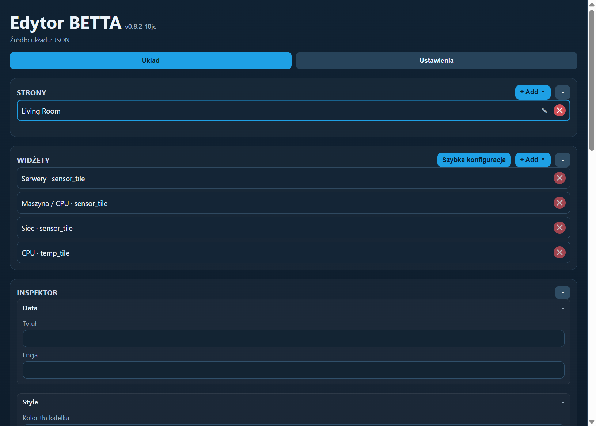 | 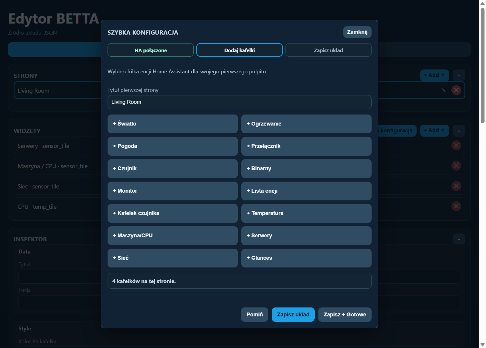 |

### Settings / Ustawienia (WWW)
| Screen / Ekran (screensaver) | System |
|------------------------------|--------|
| 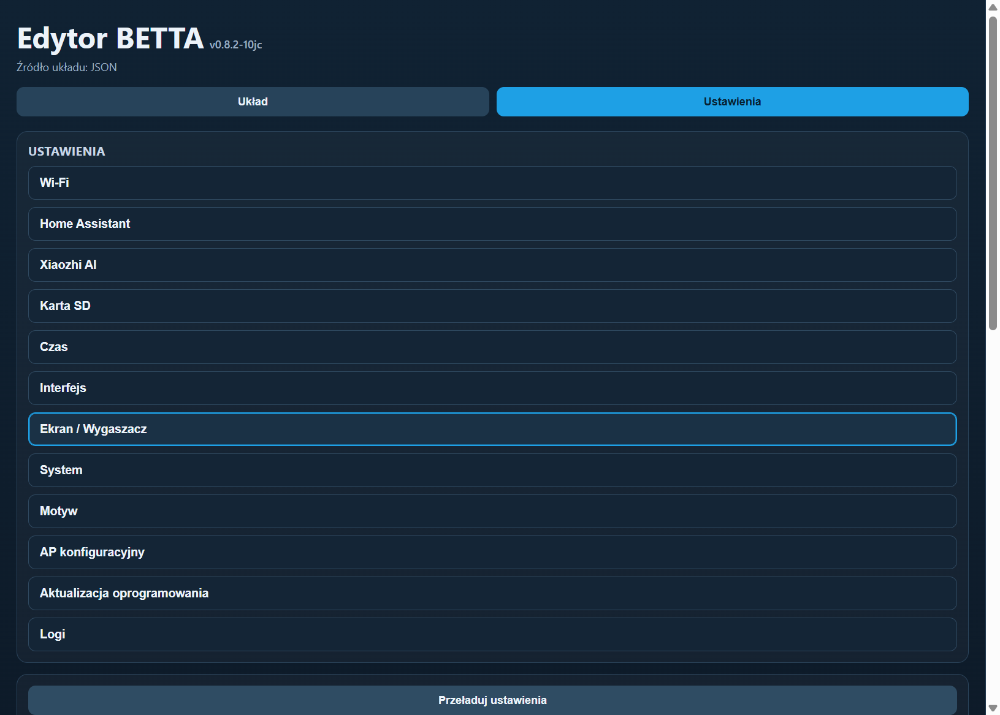 | 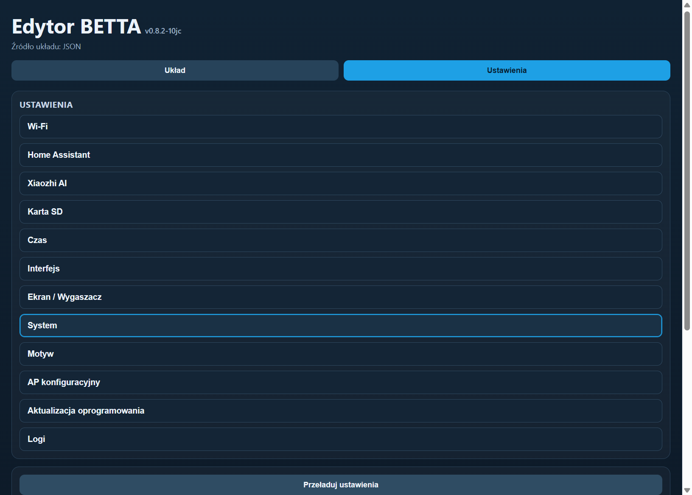 |

| Wi-Fi |
|-------|
| 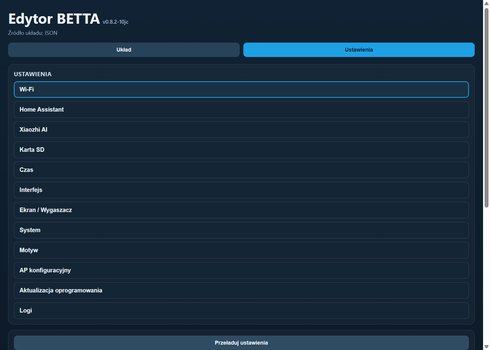 |

### Widget configuration / Konfiguracja widżetów (WWW)
| Machine / CPU tile (font sizes, LAN/WAN, power) | Network tile (LAN/WAN, TCP/UDP, devices) | Temperature tile (graphic ring) |
|-------------------------------------------------|------------------------------------------|---------------------------------|
| 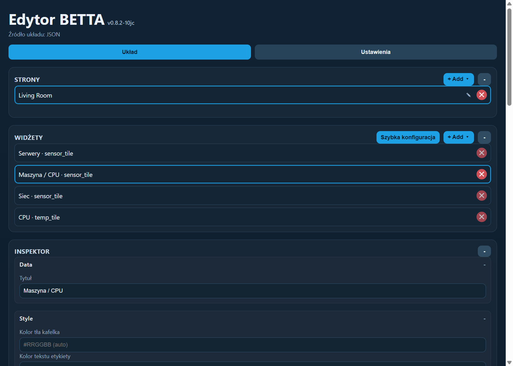 |  | 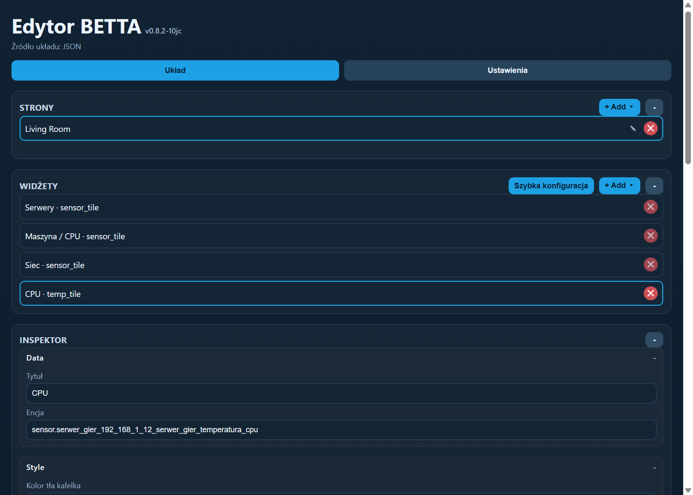 |

### On-device dashboard / Pulpit na panelu
| Live dashboard / Pulpit na żywo | Top bar | Navigation | Tile area |
|---------------------------------|---------|------------|------------|
| 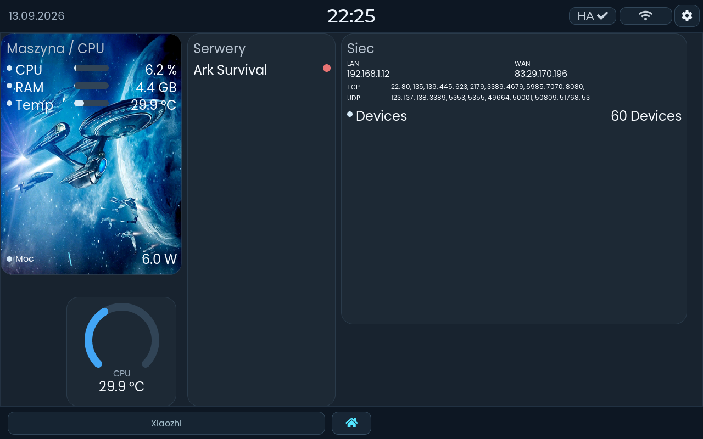 | 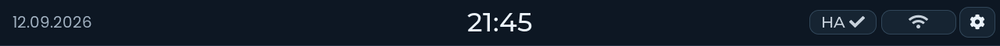 | 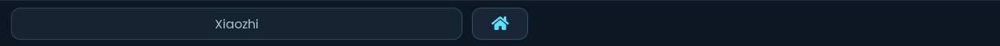 | 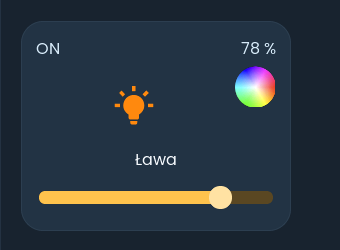 |

### Photos of the working panel / Zdjęcia działającego panelu
| Main menu / Menu główne | Screensaver / Wygaszacz |
|-------------------------|-------------------------|
| 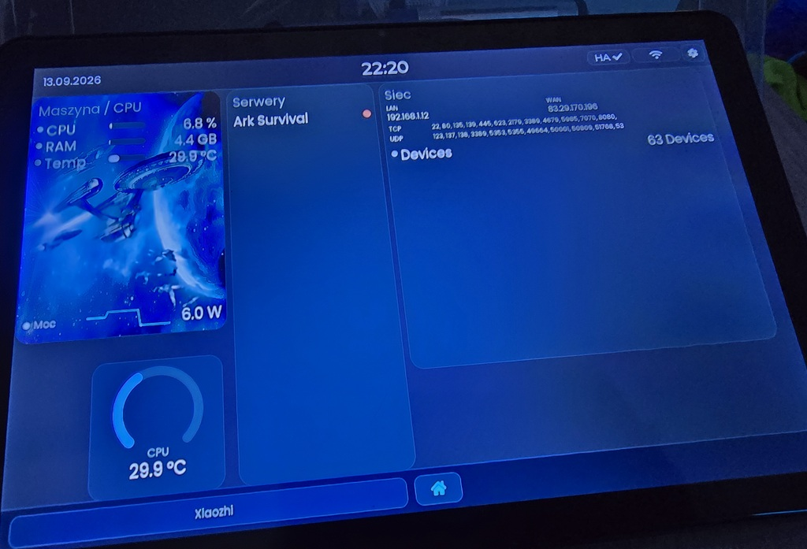 | 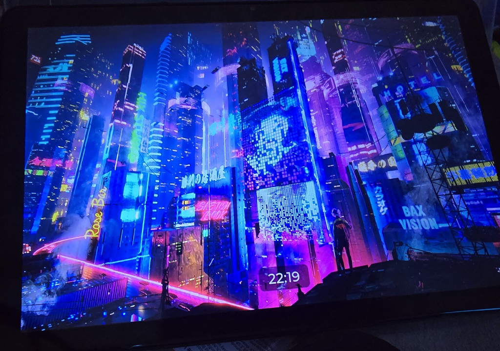 |

---

## ✨ Features / Funkcje

**EN**
- **Live Home Assistant link** — WebSocket connection with REST fallback (forecasts, long-poll states).
- **On-device editor** — BETTA Editor in the browser at `http://<panel-ip>`; multi-page layouts, drag-and-drop, room-grouped entity picker. No rebuild needed.
- **Widget library** — sensor tile, temperature tile (text + graphic modes), machine/CPU tile, servers tile, network tile (LAN/WAN/TCP/UDP), Glances tile, light, switch, button, slider, graph, monitor, entity list, gauge/bars, weather (up to 5-day forecast), media player, todo, Roborock, energy dashboard.
- **Energy dashboard** — automatic grid / solar / battery / gas / water flow from the Home Assistant energy model.
- **Graphs** — line, smoothed line, bar charts; event-rate sampling up to 4096 points with progressive decimation.
- **Graphical screensaver** — full-screen wallpaper (SD card) + optional clock, dim-after-idle, night mode, per-state brightness sliders.
- **System settings** — daily auto-restart, volume, backlight/screen-power control, static IP, log viewer.
- **First-run provisioning** — `BETTA-Setup` Wi-Fi AP, guided Wi-Fi + Home Assistant setup, Quick Setup starter dashboard.
- **OTA updates** — upload `.ota.bin` or point to an OTA URL from the editor.
- **Multilingual** — English, German, Spanish, French + custom translation JSON upload/download.
- **SD card backup** — export/import full configuration (menu, entities, layout) to/from SD as a backup copy.
- **Entity scale** — imports up to **3600** Home Assistant entities (`APP_HA_MAX_ENTITIES`).

**PL**
- **Połączenie na żywo z Home Assistant** — WebSocket z fallbackiem REST (prognozy, long-poll).
- **Edytor na urządzeniu** — BETTA Editor w przeglądarce pod `http://<ip-panelu>`; układy wielostronicowe, przeciąganie, grupowany wybór encji. Bez kompilacji.
- **Biblioteka kafelków** — kafelek czujnika, kafelek temperatury (tryb tekstowy + graficzny), kafelek maszyna/CPU, serwery, sieć (LAN/WAN/TCP/UDP), Glances, światło, przełącznik, przycisk, suwak, wykres, monitor, lista encji, wskaźniki/paski, pogoda (do 5 dni), media player, todo, Roborock, panel energii.
- **Panel energii** — automatyczna wizualizacja sieć / słońce / bateria / gaz / woda.
- **Wykresy** — liniowe, wygładzone, słupkowe; próbkowanie do 4096 punktów z decymacją.
- **Wygaszacz graficzny** — tapeta (karta SD) + opcjonalny zegar, przyciemnianie po bezczynności, tryb nocny, osobne suwaki jasności.
- **Ustawienia systemowe** — codzienny automatyczny restart, głośność, sterowanie podświetleniem, statyczne IP, podgląd logów.
- **Pierwsze uruchomienie** — AP `BETTA-Setup`, kreator Wi-Fi + Home Assistant, szybka konfiguracja pulpitu.
- **Aktualizacje OTA** — wgranie `.ota.bin` lub URL OTA z edytora.
- **Wielojęzyczność** — angielski, niemiecki, hiszpański, francuski + własne tłumaczenia (JSON).
- **Backup na SD** — eksport/import pełnej konfiguracji (menu, encje, układ) jako kopia zapasowa.
- **Skala encji** — import do **3600** encji Home Assistant (`APP_HA_MAX_ENTITIES`).

---

## 🔌 Hardware — this variant / ten wariant

| Item / Element                | Value / Wartość                                                                 |
|-------------------------------|---------------------------------------------------------------------------------|
| Board / Płytka                | Guition **JC8012P4A1C-I-W-Y**                                                   |
| SoC                           | ESP32-P4, 32 MB flash, Hex PSRAM @ 200 MHz                                      |
| Display / Wyświetlacz         | 10.1" **1280×800** landscape (MIPI-DSI **JD9365**, 800×1280 rotated 270°)       |
| Touch / Dotyk                 | **GSL3680** capacitive (I2C: SDA GPIO7, SCL GPIO8; RST GPIO22, INT GPIO21)      |
| Backlight / Podświetlenie     | LEDC PWM (GPIO23)                                                               |
| Network / Sieć                | ESP32-C6 co-processor (ESP-Hosted, SDIO)                                        |
| Variant macro / Makro         | `CONFIG_APP_PANEL_VARIANT_10INCH_JC`                                            |
| Build preset / Predefiniowany | `panel10jc`                                                                     |
| Static IP / IP statyczne      | ostatni oktet `.36` (configurable / konfigurowalne)                              |
| Cameras / Kamery              | ❌ disabled / wyłączone                                                          |
| Xiaozhi AI                    | ❌ disabled / wyłączony                                                          |

---

## 🚀 Getting started / Szybki start

**EN**
1. **Flash** the factory image (`release/betta86-ha-panel-v0.8.2-panel10.factory.bin`) with any ESP32 flasher, e.g. browser-based [esptool-js](https://espressif.github.io/esptool-js/) — use the outer USB-C port, baud `115200`, offset `0x0`.
2. **Reboot** — the panel opens a Wi-Fi AP named `BETTA-Setup`.
3. Connect to `BETTA-Setup`, open `http://192.168.4.1`, choose country, scan and save your Wi-Fi.
4. After reboot the panel joins your LAN. Open its IP in a browser, link Home Assistant with a long-lived access token, build your first page via **Quick Setup**.
5. Optionally set a static IP (last octet `.36`) and review logs in **Settings**.
6. Future updates install via **OTA** from the editor — no cable needed.

**PL**
1. **Wgraj** obraz fabryczny (`release/betta86-ha-panel-v0.8.2-panel10.factory.bin`) dowolnym programem ESP32, np. [esptool-js](https://espressif.github.io/esptool-js/) — port USB-C, baud `115200`, offset `0x0`.
2. **Zrestartuj** — panel uruchomi AP Wi-Fi o nazwie `BETTA-Setup`.
3. Połącz się z `BETTA-Setup`, otwórz `http://192.168.4.1`, wybierz kraj, zeskanuj i zapisz swoją sieć.
4. Po restarcie panel dołącza do Twojej sieci LAN. Otwórz jego IP w przeglądarce, połącz Home Assistant tokenem długoterminowym i zbuduj pierwszą stronę przez **Szybką konfigurację**.
5. Opcjonalnie ustaw statyczne IP (ostatni oktet `.36`) i sprawdź logi w **Ustawieniach**.
6. Kolejne aktualizacje instaluj przez **OTA** z edytora — bez kabla.

---

## 🛠️ Building from source / Budowanie ze źródeł

Prerequisites / Wymagania: **ESP-IDF v5.5.5**, Python 3.11+, local BSP shim `components/jc8012_bsp` and the JD9365 + GSL3680 components in `components/`.

```powershell
# Guiton 10 (this variant / ten wariant)
. C:\Espressif\frameworks\esp-idf\export.ps1
idf.py -B build-panel10jc -DSDKCONFIG_DEFAULTS="sdkconfig.defaults;sdkconfig.defaults.panel10jc" build

# Package release images (factory + OTA) / Pakowanie obrazów (factory + OTA)
pwsh tools/make_factory_bin.ps1 -Variant panel10jc
```

Build artifacts land in `build-panel10jc/`; factory/OTA images land in `release/` and `release/ota/`. The ready-to-flash app binary is also provided in [`Binary/`](Binary/).

> **Note / Uwaga:** the ESP32-P4 target is declared in [`sdkconfig.defaults`](sdkconfig.defaults) (`CONFIG_IDF_TARGET="esp32p4"`), so a fresh clone builds **without** running `idf.py set-target` first. / Target ESP32-P4 jest zadeklarowany w [`sdkconfig.defaults`](sdkconfig.defaults), więc świeży klon buduje się **bez** `idf.py set-target`.
> `managed_components/` is **vendored** in this repository so the build works offline (the C6 Wi-Fi coprocessor drivers included). / `managed_components/` jest **dołączony** do repozytorium, więc build działa offline (ze sterownikami koprocesora Wi-Fi C6).
> Generated `sdkconfig` and `build*/` are regenerated on first configure. The generated font `.c` files and `main/idf_component.yml` **are** included so the project builds out of the box.

---

## 📁 Project structure / Struktura projektu

| Path / Ścieżka                 | Description / Opis                                                                 |
|--------------------------------|------------------------------------------------------------------------------------|
| `main/`                        | Application core: UI (LVGL), HA WebSocket, Glances, settings, OTA, diagnostics      |
| `main/drivers/`                | JD9365 DSI panel, GSL3680 touch, backlight, SD, audio codec                        |
| `main/ui/`                     | Pages, widgets/tiles, fonts, assets (incl. screensaver wallpaper)                  |
| `components/`                  | Local BSP shim `jc8012_bsp`, JD9365 + GSL3680 display/touch components             |
| `components/webui/www/`        | BETTA Editor web app (served from the panel)                                       |
| `release/`                     | Factory + OTA images for all panel variants                                        |
| `Binary/`                      | Ready-to-flash `betta-ha-panel-10jc.bin` (+ zip)                                   |
| `tools/`                       | `make_factory_bin.ps1` — image packaging helper                                    |
| `images/`                      | Screenshots, logo and example photos used by this README                            |

---

## ⚙️ Web editor — settings reference / Edytor WWW — ustawienia

The editor has two tabs: **Layout** (pages, widgets, inspector) and **Settings**.
Edytor ma dwie zakładki: **Układ** (strony, kafelki, inspektor) i **Ustawienia**.

| EN | PL |
|----|----|
| **Wi-Fi** — SSID, password, country, BSSID lock, scan | **Wi-Fi** — SSID, hasło, kraj, blokada BSSID, skanowanie |
| **Home Assistant** — URL + long-lived token | **Home Assistant** — URL + token długoterminowy |
| **Xiaozhi AI** — hidden/disabled on this variant | **Xiaozhi AI** — ukryte/wyłączone w tym wariancie |
| **SD card** — mount, storage, config backup | **Karta SD** — montowanie, pamięć, backup konfiguracji |
| **Time** — NTP/timezone | **Czas** — NTP/strefa czasowa |
| **Interface** — language, UI scale, fonts | **Interfejs** — język, skalowanie UI, czcionki |
| **Screen / Screensaver** — wallpaper, clock, brightness, dim/night mode | **Ekran / Wygaszacz** — tapeta, zegar, jasność, przyciemnianie/tryb nocny |
| **System** — daily auto-restart, volume, reboot | **System** — codzienny restart, głośność, restart |
| **Theme** — colors | **Motyw** — kolory |
| **AP config** — setup AP | **AP konfiguracyjny** — AP konfiguracyjne |
| **OTA update** — file or URL | **Aktualizacja** — plik lub URL |
| **Logs** — live system/error log | **Logi** — podgląd logów systemowych |

---

## ⚖️ License & attribution / Licencja i atrybucja

- **License / Licencja:** [LicenseRef-FNCL-1.1 (Federation Non-Commercial License v1.1)](LICENSE) — **non-commercial** use. Commercial use requires a separate written license from the copyright holder. See [`LICENSE`](LICENSE).
- **Copyright:** `Copyright (c) 2026 Cpt_Kirk`.
- **Upstream / Źródło:** this is a port/extension of **[BETTA-HA-PANEL](https://github.com/cptkirki/BETTA-HA-PANEL)** by **Cpt_Kirk (cptkirki)**. All original work and branding remain theirs. See [`README.UPSTREAM.md`](README.UPSTREAM.md).
- **This variant / Ten wariant:** `panel10jc` for Guition **JC8012P4A1C-I-W-Y** — cameras and Xiaozhi removed, panel-specific drivers added (JD9365 DSI, GSL3680 touch), graphical screensaver, extended settings and a scaled entity model (3600 entities). Full change history in [`release-notes.md`](release-notes.md).

> **PL:** Projekt udostępniany na licencji **FNCL-1.1 (niekomercyjnej)** — wykorzystanie komercyjne wymaga osobnej pisemnej licencji od autora. To port/rozszerzenie **BETTA-HA-PANEL** autorstwa **Cpt_Kirk (cptkirki)**; cała oryginalna praca i nazwa należą do niego.

---

## ⚠️ Disclaimer / Zastrzeżenie

**EN** — Provided "AS IS", without warranty of any kind. The author is not responsible for damage to hardware, data loss or incorrect energy/server readings. Configuration values (Wi-Fi password, Home Assistant token) are stored on the device (NVS/SD), **not** in this repository — keep your backups private.

**PL** — Oprogramowanie udostępnione „AS IS", bez jakiejkolwiek gwarancji. Autor nie odpowiada za uszkodzenia sprzętu, utratę danych ani błędne odczyty energii/serwerów. Dane konfiguracyjne (hasło Wi-Fi, token Home Assistant) przechowywane są na urządzeniu (NVS/SD), **nie** w tym repozytorium — kopie zapasowe trzymaj prywatnie.
